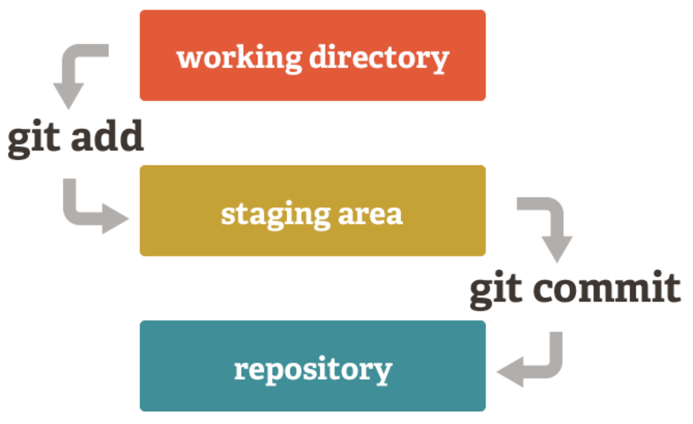

# Git - praca z lokalnym repozytorium 

## Wstęp

**Potrzeba**:
- Cofnąć się do starszej wersji.
- Połączyć wersje rozwijane przez dwie różne osoby.
- Spojrzeć do historii projektu.
- Znaleźć moment w którym pojawił się błąd w projekcie.

**Problem**: Zapisując pliki na komputerze mamy tylko najnowszą wersję.

**Rozwiązanie**: System kontroli wersji (**V**ersion **C**ontrol **S**ystem)

GIT - najpopularniejszy, obecnie używany system kontroli wersji

Jest to szereg komend do wykorzystania w terminalu, które pomagają zarządzać wersjami projektu.

Istnieją przeróżne narzędzia z interfejsem graficznym, które ułatwiają pracę na nim.


Git to CLI (Command Line Interface). Jest to "przeciwieństwo" interfejsu graficznego. Wszystki operacje wykonuje się w konsoli (wierzu poleceń - command line)

## Nawigacja po katalogach w konsoli

W konsoli/terminalu możemy robić takie same operacje na plikach jak w narzędziu graficznym.

- pwd - print working directory
- mkdir - make directory
- touch - create empty file
- ls - list
- cd <ścieżka> - change directory
- . - obecna ścieżka
- .. - poziom wyżej
- ./project - folder desktop zaczynając od obecnej ścieżki
- ~/ - ścieżka zaczynająca od katalogu domowego
- / - ścieżka absolutna

### Zadanie

1. Otwórz terminal.
2. Sprawdź w jakim katalogu się znajdujesz, jaka prowadzi do niego ścieżka oraz jakie katalogi zawiera.
3. Stwórz katalog "projects", a w nim "git-workshop".
4. Przejdź do tego katalogu.
5. Wyświetl obecną ścieżkę.

jak nawigować po katalogach z poziom terminala
jak operować (CRUD) na katalogach i plikach z poziom terminala

## Konfiguracja Gita

``` bash
git --version # upewniamy się, że mamy Gita
git config --list # pokazuje aktualną konfigurację 

git config --global user.name "Marek Szkudelski"
git config --global user.email "marek@szkudelski.dev"
git config --global core.editor "code --wait"
```

jak skonfigurować Gita (username, email, editor)

## Repozytorium

Główny folder naszego projektu.

Jest kontrolowany całkowicie przez Gita.

Info, które potrzebuje Git jest w ukrytym folderze `.git`.

jak założyć repozytorium lokalne

### Tworzenie repo

Możemy to zrobić na dwa sposoby:
- pobrać istniejące repo
- utworzyć repo w danym folderze

Tworzenie repo od zera:
```bash
git init
```
Wyświetlanie statusu repo:
```bash
git status
```

>Od teraz Git śledzi wszystkie zmiany.

Wyświetlanie konkretnych zmian:
``` bash
git diff
```

### Zadanie
1. We wcześniej utworzonym folderze utwórz repo.
2. Stwórz w nim pusty plik `index.txt`
3. Zobacz jaki jest status repo.
4. Dowolnym sposobem dodaj jakiś tekst do pliku. (Jeśli nie chcesz wychodzić z terminala, to po prostu przeklej `echo "text" >> index.txt`)
5. Sprawdź jakie zmiany wykrył Git.

> **Uwaga!**
>
> Git śledzi zmiany w katalogu, ale to nie oznacza, że są one zapisywane!

## Zapisywanie zmian w repo.

Trzeba zawsze wykonać 2 kroki, żeby zapisać zmiany w repo.



Working directory - to co aktualnie widzimy w repo, wszystkie niezapisane zmiany

Stating area - zmiany oczekujące na zapisanie

Repository - wszystkie zapisane zmiany

> Ten sam plik może zupełnie inaczej wyglądać w każdym z tych trzech obszarów

> Nawet cały folder może się zupełnie różnić pomiędzy tymi obszarami

TODO wymyśleć dobrzy przykład z życia

Dodanie zmiany do staging area:
``` bash
git add filename

git add . # wszystkie zmiany
```

Dodanie zmiany do repozytorium:
``` bash
git commit # otwiera edytor

git commit -m "opis zmian"
```

jak i kiedy zapisywać zmiany w repozytorium
jak identyfikować obszary w gicie i do czego one służą (working directory, staging, repository)

### Zadanie

1. Dodaj aktualne zmiany do staging area.
2. Nanieś kolejne zmiany na nasz plik.
3. Sprawdź jaki jest status repo.
4. Zapisz wszystkie zmiany w repo.

## Gałęzie


jak i po co zakładać gałęzie i jak się między nimi przełączać
czym jest detached HEAD
czym jest merge i jak rozwiązać konflikt
czym jest fast-forward merge, kiedy zachodzi i jak go uniknąć
